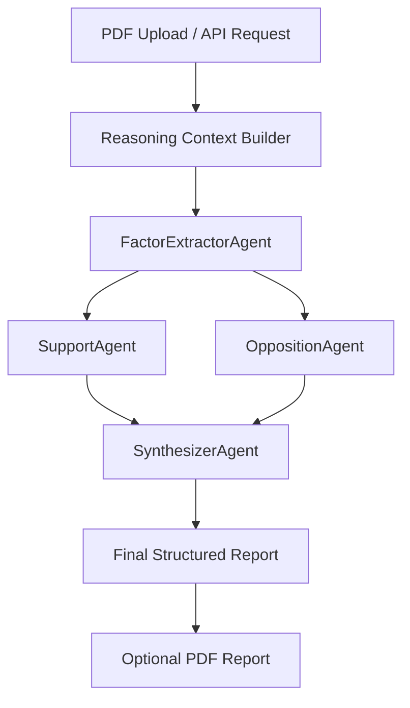

# Project AETHER – Multi-Agent Debate & Reasoning System

[](https://www.python.org/)
[](https://fastapi.tiangolo.com/)
[](https://reactjs.org/)
[](https://vitejs.dev/)
[](https://ai.google.dev/)
[](https://cloud.google.com/vertex-ai)

Coordinator-driven **multi-agent AI system** for structured debate, opposition, and synthesis over a normalized reasoning context.

This repository is a **fork of the original Project AETHER** and includes improvements to orchestration, reasoning pipelines, and reporting.

## Attribution

This repository is a fork of the original project created by:

- https://github.com/AdityaC-07/project-aether

The core system architecture and initial implementation were developed in the original repository.

## My Contributions

- Improved backend orchestration pipeline for multi-agent reasoning
- Integrated Gemini via Vertex AI for agent inference
- Enhanced debate workflow across FactorExtractor, Support, Opposition, and Synthesizer agents
- Implemented structured JSON logging for reasoning traceability
- Added automated PDF report generation
- Expanded API endpoints for document analysis and reporting

## Features

### Backend (Python/FastAPI)

- **Multi-Agent Orchestration**: FactorExtractor, Support, Opposition, and Synthesizer agents working in sequence
- **PDF Processing**:
  - Text extraction from PDFs
  - Table extraction and parsing (numeric values -> metrics)
  - Metadata extraction
- **Structured Debate System**: Automatic pro/con analysis for each identified factor
- **Reasoning Context Management**: Unified data model for facts, metrics, assumptions, and limitations
- **JSON Logging**: All analysis sessions logged with full reasoning trace
- **PDF Report Generation**: Formatted PDF reports with embedded analysis

### Frontend (React/Vite)

- **Interactive UI**: Components for uploading PDFs, entering factors, and viewing results
- **Real-time Analysis**: Direct integration with backend API
- **Responsive Design**: Mobile-friendly interface
- **Factor Management**: Input custom factors with domain tagging
- **Results Display**: Visualized debate logs and synthesis

## Tech Stack

- **Backend**: Python 3.10+, FastAPI, Pydantic v2, Gemini via Vertex AI (google-genai)
- **Frontend**: React 19+, Vite, CSS
- **Data Processing**: PyPDF2, Camelot (table extraction)
- **Async**: async/await architecture
- **Logging**: Structured JSON logging
- **PDF Generation**: ReportLab

## AI Concepts Demonstrated

- Multi-agent LLM orchestration
- Debate-based reasoning
- Context-grounded inference
- Deterministic agent coordination
- Schema-constrained generation
- Structured reasoning pipelines

## Architecture Overview



### Key Properties

- Agents never call each other directly
- Orchestrator enforces deterministic execution
- Agents rely strictly on provided context
- Outputs follow strict JSON schemas
- Table parsing is optional and fault-tolerant

## Setup

### 1. Create and activate a virtual environment

```powershell
python -m venv .venv
.\.venv\Scripts\Activate.ps1
```

### 2. Install dependencies

```bash
pip install -r requirements.txt
```

### Note on Camelot

Camelot table extraction may require optional system libraries:

- Works out-of-the-box on Windows
- macOS/Linux may require `graphviz`

### 3. Configure environment variables

Create `.env` in the project root or `backend` folder:

```env
GCP_PROJECT=YOUR_GCP_PROJECT_ID
GCP_LOCATION=us-central1
GEMINI_MODEL=gemini-2.5-pro
```

`.env` files are git-ignored and must not be committed.

Configure Google Cloud authentication:

```bash
gcloud auth application-default login
```

## Run the Backend

```bash
cd backend
uvicorn app.main:app --host 0.0.0.0 --port 8000
```

API root: `http://localhost:8000`

## Run the Frontend

```bash
cd frontend
npm install
npm run dev
```

Frontend: `http://localhost:5173`

Optional frontend environment override:

```env
VITE_API_BASE=http://localhost:8000
```

## API Endpoints

### `POST /analyze`

Analyze structured reasoning context.

Returns:

- Extracted factors
- Debate logs
- Synthesized final report

### `POST /analyze-pdf`

Upload and analyze a PDF.

Features:

- Text extraction
- Table extraction
- Metric generation

### `POST /analyze-report`

Returns a formatted PDF report including:

- Executive summary
- Debate logs
- Extracted factors
- Confidence score

### `POST /analyze-pdf-report`

Combines PDF extraction and PDF report generation.

### `GET /status`

Returns orchestration status metadata.

### `GET /download-report`

Downloads the most recent generated report.

## Data Models

### `Metric`

```python
class Metric(BaseModel):
  name: str
  region: Optional[str] = None
  value: float
```

### `ReasoningContext`

```python
class ReasoningContext(BaseModel):
  narrative: str
  extracted_facts: List[str] = []
  metrics: List[Metric] = []
  assumptions: List[str] = []
  limitations: List[str] = []
```

## PDF Processing

### Table Extraction

Uses Camelot.

Process:

- Extract tables from all pages
- First row -> headers
- First column -> region labels
- Numeric values -> metrics
- Errors are logged but never crash the pipeline

## Logging

All reasoning sessions are logged as structured JSON.

Location: `logs/reasoning_logs.json`

The `logs/` directory is git-ignored.

Logs include the full reasoning trace.

## Key Design Principles

- No hallucination: agents rely strictly on provided context
- Debate-first reasoning: every claim is challenged
- Deterministic orchestration: orchestrator controls execution
- Schema-validated outputs
- Graceful degradation
- Transparent reasoning

## Future Enhancements

- OCR support for scanned PDFs
- Chart extraction and analysis
- Multi-language support
- Custom domain definitions
- Result caching
- Collaborative analysis
- Integration with additional LLM providers
